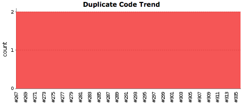
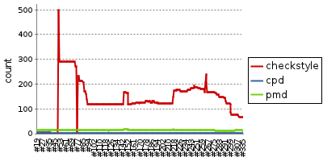

.. .. *********************
.. .. ROLES DEFINITION
.. .. *********************
.. role:: bullet

Unit Testing
===============================

What is a Unit Test?
--------------------

In computer programming, unit testing is a method by which individual units of source code are tested to determine if they are fit for use. A unit is the smallest testable part of an application.

The PHP Quality Assurance Toolchain
------------------------------------

Here is an overview of what tools we need to install:

* PHPUnit_ is a unit testing software framework for the programming language PHP. PHPUnit was created with the view that the sooner you detect your code mistakes, the quicker you can fix them. Itself, PHPUnit is the de-facto standard for the unit testing of PHP code.
* PHP_CodeSniffer_ is the most commonly used tool for static analysis of PHP code. It is typically used to detect violations of code formatting standards but also sup- ports software metrics as well as the detection of potential defects.
* phpcpd_ (PHP Copy/Paste Detector) searches for duplicated code in a PHP project.
* PHP_Depend_ is a tool for static code analysis of PHP code that is inspired by JDepend.
* phpmd_ (PHP Mess Detector) allows the definition of rules that operate on the raw data collected by PHP_Depend.
* phploc_ measures the scope of a PHP project by, among other metrics, means of different forms of the Lines of Code (LOC) software metric.
* PHP_CodeBrowser_ is a report generator that takes the XML output of the afore- mentioned tools as well as the sourcecode of the project as its input.
* Although it is currently being replaced by more modern tools such as phpdox_, we will use PHPDocumentor_ for automated API documentation generation for PHP code.

.. _PHPUnit: https://github.com/sebastianbergmann/phpunit/
.. _PHP_CodeSniffer: http://pear.php.net/package/PHP_CodeSniffer/
.. _phpcpd: https://github.com/sebastianbergmann/phpcpd
.. _PHP_Depend: http://pdepend.org/
.. _phpmd: http://phpmd.org/
.. _phploc: https://github.com/sebastianbergmann/phploc
.. _PHP_CodeBrowser: http://blog.mayflower.de/archives/626-PHP_CodeBrowser-goes-stable.html
.. _phpdox: https://github.com/theseer/phpdox
.. _PHPDocumentor: http://pear.php.net/package/PHPDocumentor/

 The graphic bellow shows what tool generates what reports and how they get aggregated within Jenkins eventually (or Cruise Control as an alternative tool).

.. graphviz::

     digraph d {
          phpunit -> "JUnit XML"
          phpunit -> "Clover XML"
          phpcs -> "Checkstyle XML"
          pdepend -> "JDepend XML"
          phpmd -> "PMD XML"
          "PMD XML" -> Jenkins
          "JDepend XML" -> Jenkins
          "Checkstyle XML" -> Jenkins
          "Clover XML" -> Jenkins
          "JUnit XML" -> Jenkins
     }

Configure the environment
--------------------------------

* EXT:phpunit is installed from the repository::

    cd typo3conf/ext
    svn co https://svn.typo3.org/TYPO3v4/Extensions/phpunit/trunk phpunit

* A patch needs to be applied in order to improve the Code Coverage::

	# Download patch form http://forge.typo3.org/issues/33842 into EXT:phpunit
	patch -p0 < bug_33842.diff

* Make sure a BE User "_cli_phpunit" is created
* :file:`build.xml` is added and personalized along with :file:`build/phpcs.xml` and :file:`build/phpmd.xml`

* A core is defined::

	mkdir /t3core/typo3_src-4.5.11 (without git)
	cd /t3core/typo3_src.git
	git fetch --tags
	git checkout TYPO3_4-5-11; git submodule update
	./git-archive-all.sh  && tar -xf  typo3_src.git.tar -C /t3core/typo3_src-4.5.11 && rm typo3_sr.git.tar

Configuring Rules Code Sniffer
--------------------------------

Code Sniffer provides a mechanism to override default settings. Most of the time, the default configuration is set in the PHP Class of Code Sniffer itself. However, this is possible to override a value in the Standard XML file, commonly put in ``build/phpcs.xml``. XML is the language to change such configuration. Let take an example, for the rule ``ValidCommentLineLength`` which has a default value of 80 characters::

	<rule ref="TYPO3.Commenting.ValidCommentLineLength" >

Assume we want to extend this limit to 130 characters, this can be achieved with following configuration::

	<rule ref="TYPO3.Commenting.ValidCommentLineLength" >
		<properties>
			<property name="maxCommentLength" value="130"/>
		</properties>
	</rule>

Though, notice there is a bug in the code provided by the `TYPO3 PEAR project`_ which hinders the overriding mechanism because the properties of the class are set as **protected** while they should be **public**. Changing the property visibility is not a bit deal and can be achieved by editing the source code::

	# Output the Home Path of PEAR.
	pear config-show | grep "PEAR directory"

	# Go to the PEAR
	cd /path/to/PEAR

	# Open the file involved
	nano -w PHP/CodeSniffer/Standards/TYPO3/Sniffs/Commenting/ValidCommentLineLengthSniff.php

	-> Replace "protected" by "public"

.. _TYPO3 PEAR project: http://pear.typo3.org/

Output generated
--------------------------------

Jenkins is the tool for managing a continuous integration. Basically, Jenkins takes care of fetching the source code, running the metrics tools and generating report from that. Every extension has its own job within Jenkins. A typical view of a job is:

.. image:: Images/jenkins_detail.png
	:width: 800px

* :bullet:`1` Coding Guide Line report generated by PHP_CodeSniffer_
* :bullet:`2` PHP Mess Detector report generated by phpmd_
* :bullet:`3` Unit Test coverage of the source code generated by PHPUnit_
* :bullet:`4` API Documentation generated by PHPDocumentor_
* :bullet:`5` Code Browser Tool generated by by PHP_CodeBrowser_

More charts are generated for a better insight of the trends.

.. figure:: Images/CheckStyle.png

	Coding Guide Lines evolution

.. figure:: Images/PMD.png

	the Mess Detection evolution

	Copy Paste Detector

.. figure:: Images/Coverage.png

	Unit Test Coverage metrics

	Synoptic information of CGL, PMD, CPD
